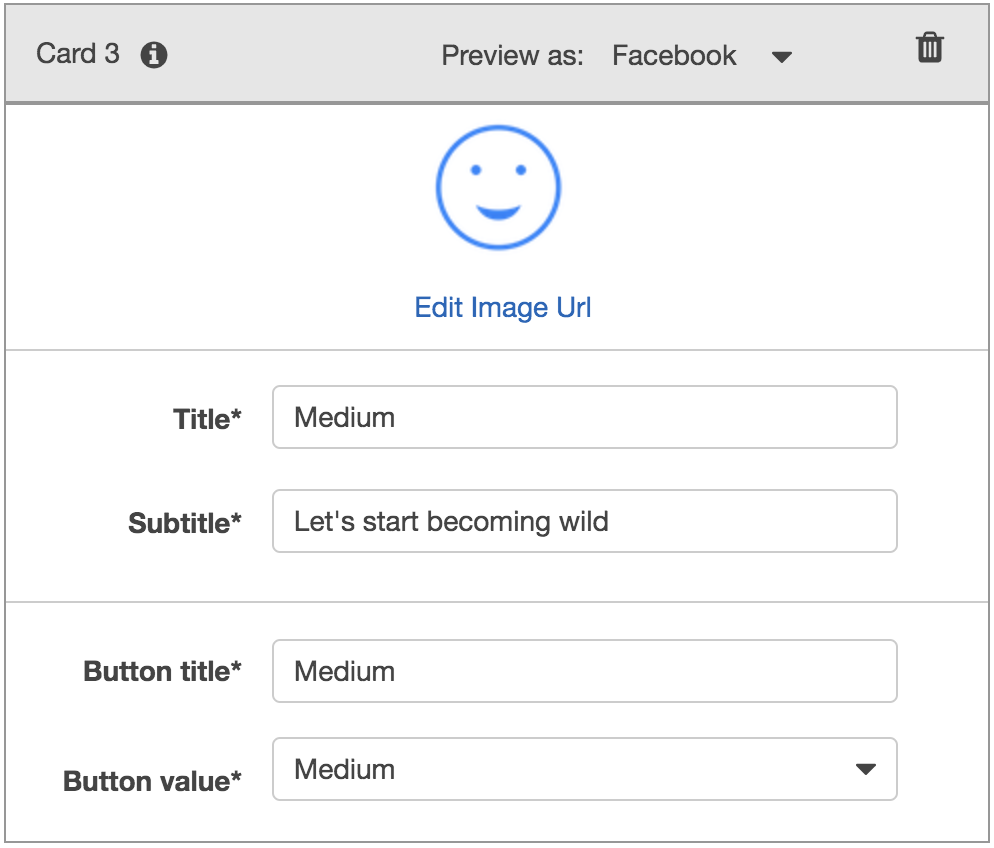
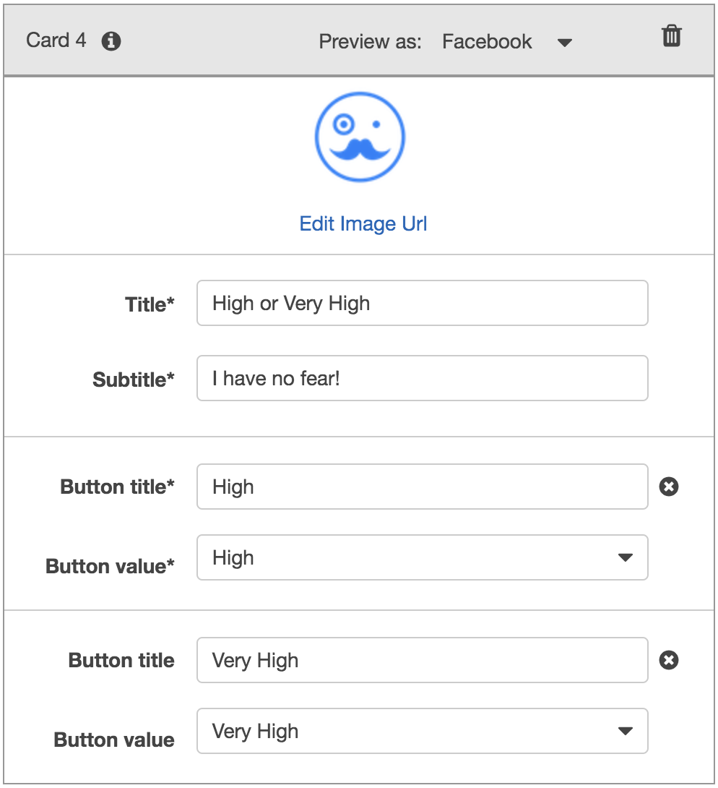
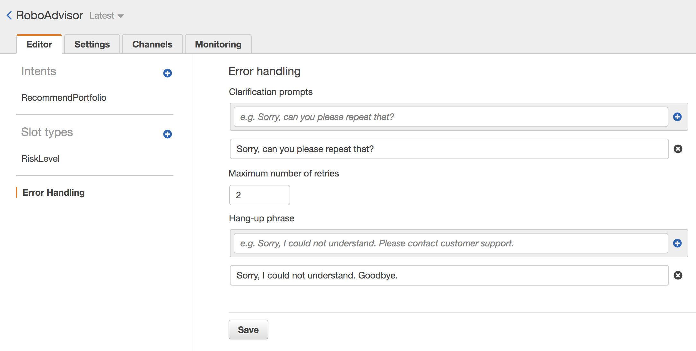
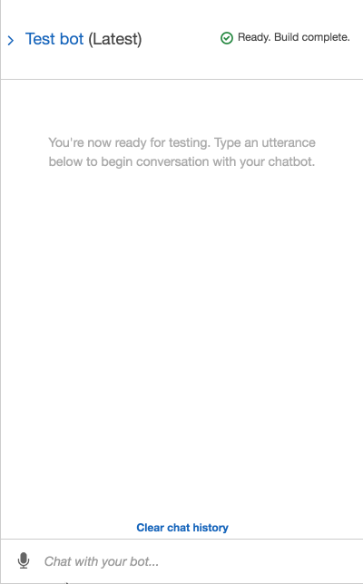

# Unit 13 Homework Assignment - The Power of the Cloud and Unsupervised Learning

## Background

It is time to take what you have learned about unsupervised learning and the AWS services and apply it to new situations. For this assignment, you will need to complete **one of two** (not both) challenges. Which challenge you take on is your choice. Just be sure to give it your all -- as the skills you hone will become powerful tools in your FinTech tool belt.

### Before You Begin

1. Create a new repository for this project called `unit13-challenge`. **Do not add this homework to an existing repository**.

2. Clone the new repository to your computer.

3. Inside your local git repository, create a directory for the challenge assignment you choose. Use folder names corresponding to the challenges: **RoboAdvisor** or **ClusteringCrypto**.

4. Add your solution files to this folder.

5. Push the above changes to GitHub or GitLab.

## Option 1: Robo Advisor for Retirement Plans

_Photo by [Alex Knight](https://www.pexels.com/@alex-knight-1272316?utm_content=attributionCopyText&utm_medium=referral&utm_source=pexels) from [Pexels](https://www.pexels.com/photo/high-angle-photo-of-robot-2599244/?utm_content=attributionCopyText&utm_medium=referral&utm_source=pexels) | [Free License](https://www.pexels.com/photo-license/)_

### Background

You were hired as a digital transformation consultant by one of the most prominent retirement plan providers in the country; they want to increase their client portfolio, especially by engaging young people. Since machine learning and NLP are disrupting finance to improve customer experience, you decide to create a robo advisor that could be used by customers or potential new customers to get investment portfolio recommendations for retirement.

In this homework assignment, you will combine your new Amazon Web Services skills with your already mastered Python superpowers, to create a bot that will recommend an investment portfolio for a retirement plan.

You are asked to accomplish the following main tasks:

1. **[Initial Robo Advisor Configuration:](#Initial-Robo-Advisor-Configuration)** Define an Amazon Lex bot with a single intent that establishes a conversation about the requirements to suggest an investment portfolio for retirement.

2. **[Build and Test the Robo Advisor](#Build-and-Test-the-Robo-Advisor):** Make sure that your bot is working and responding accurately along with the conversation with the user, by building and testing it.

3. **[Enhance the Robo Advisor with an Amazon Lambda Function:](#Enhance-the-Robo-Advisor-with-an-Amazon-Lambda-Function)** Create an Amazon Lambda function that validates the user's input and returns the investment portfolio recommendation. This task includes testing the Amazon Lambda function and making the integration with the bot.

---

### Files

- [lambda_function.py](Starter_Files/lambda_function.py)
- [correct_dialog.txt](Test_Cases/correct_dialog.txt)
- [age_error.txt](Test_Cases/age_error.txt)
- [incorrect_amount_error.txt](Test_Cases/incorrect_amount_error.txt)
- [negative_age_error.txt](Test_Cases/negative_age_error.txt)

---

### Instructions

#### Initial Robo Advisor Configuration

In this section, you will create the `RoboAdvisor` bot and add an intent with its corresponding slots.

Sign in into your AWS Management Console and [create a new custom Amazon Lex bot](https://console.aws.amazon.com/lex/home). Use the following parameters:

- **Bot name:** RoboAdvisor
- **Output voice**: Salli
- **Session timeout:** 5 minutes
- **Sentiment analysis:** No
- **COPPA**: No
- **Advanced options**: No
- _Leave default values for all other options._

Create the `RecommendPortfolio` intent, and configure some sample utterances as follows (you can add more utterances as you wish):

- I want to save money for my retirement
- I'm ​`{age}​` and I would like to invest for my retirement
- I'm `​{age}​` and I want to invest for my retirement
- I want the best option to invest for my retirement
- I'm worried about my retirement
- I want to invest for my retirement
- I would like to invest for my retirement

This bot will use four slots, three using built-in types and one custom slot named `riskLevel`. Define the three initial slots as follows:

| Name             | Slot Type            | Prompt                                                                 |
| ---------------- | -------------------- | ---------------------------------------------------------------------- |
| firstName        | AMAZON.US_FIRST_NAME | Thank you for trusting me to help, could you please give me your name? |
| age              | AMAZON.NUMBER        | How old are you?                                                       |
| investmentAmount | AMAZON.NUMBER        | How much do you want to invest?                                        |

The `riskLevel` custom slot will be used to retrieve the risk level the user is willing to take on the investment portfolio. Create this custom slot as follows:

- Select the `+` icon next to 'Slot Types' in the 'Editor' on the left side of the screen.
- Choose `create custom slot` from the resulting display window.
- For **Slot type name**, type: riskLevel
- Select the radial dial button next to **Restrict to Slot values and synonyms**, then fill in the appropriate values and synonums. _Example_: Low, Minimal; High, Maximum.
- Click `Add slot to intent` when finished.

To format the response cards for the intent, click on the gear icon next to the intent as seen in the image below:

Next, input the following data in the resulting display window:

- **Prompt:** What level of investment risk would you like to take?
- **Maximum number of retries:** 2
- **Prompt response cards:** 4

Configure the response cards for the `riskLevel` slot as is shown bellow:

| Card 1                             | Card 2                             |
| ---------------------------------- | ---------------------------------- |
|  |  |

| Card 3                             | Card 4                             |
| ---------------------------------- | ---------------------------------- |
|  |  |

**Note:** You can download free icons from [this website](https://www.iconfinder.com/) or you can use the icons provided in the [`Icons` directory](Icons/).

Move to the _Confirmation Prompt_ section, and set the following messages:

- **Confirm:** Would you like me to search for the best investment portfolio for you now?
- **Cancel:** I will be pleased to assist you in the future.

Leave the error handling configuration for the `RecommendPortfolio` bot with the default values.

#### Build and Test the Robo Advisor

In this section, you will test your Robo Advisor. To build your bot, click on the `Build` button in the upper right hand corner. Once the build is complete, test it in the chatbot window. You should see a conversation like the one below.

#### Enhance the Robo Advisor with an Amazon Lambda Function

Create an Amazon Lambda function that will validate the data provided by the user on the Robo Advisor. Start by creating a new lambda function from scratch and name it `recommendPortfolio`. Select Python 3.7 as runtime.

##### User Input Validation

- The `age` should be greater than zero and less than 65.
- the `investment_amount` should be equal to or greater than 5000.

##### Investment Portfolio Recommendation

Once the intent is fulfilled, the bot should response with an investment recommendation based on the selected risk level as follows:

- **none:** "100% bonds (AGG), 0% equities (SPY)"
- **very low:** "80% bonds (AGG), 20% equities (SPY)"
- **low:** "60% bonds (AGG), 40% equities (SPY)"
- **medium:** "40% bonds (AGG), 60% equities (SPY)"
- **high:** "20% bonds (AGG), 80% equities (SPY)"
- **very high:** "0% bonds (AGG), 100% equities (SPY)"

